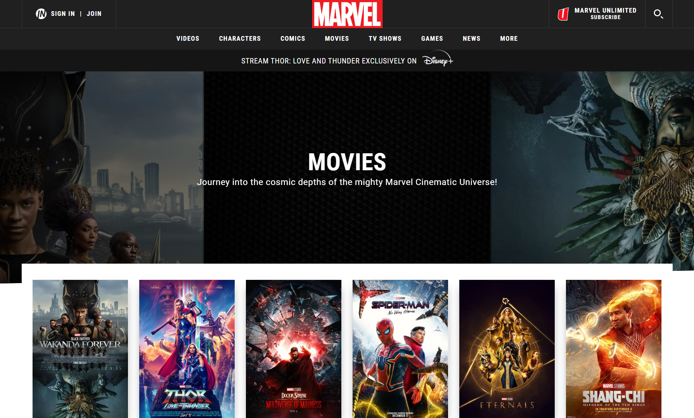
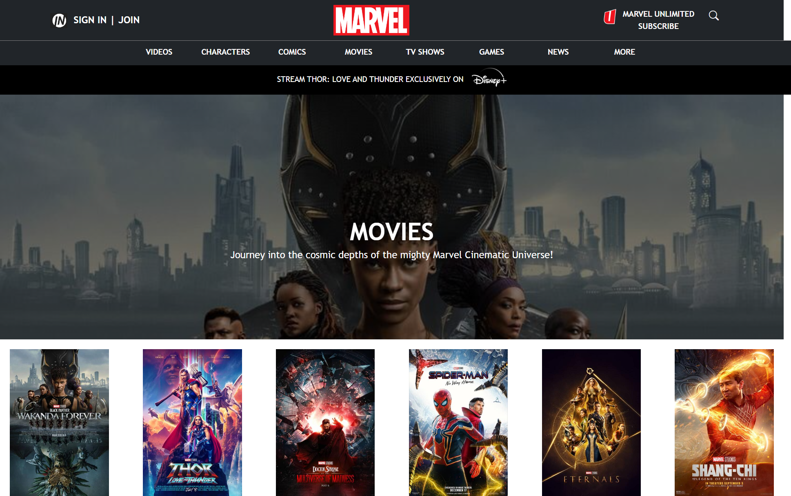

## Is this the 90s?
Let’s say you are browsing the Internet one day and stumble across a webpage with a very modern, clean design. Now compare that with the simplistic website of, say, a math professor’s academia page. There’s clearly a stark difference between the two! What factor makes the biggest impact on a website’s appearance? A website with a basic, outdated design might have solely utilized HTML and CSS. For many, this may be the quickest and most convenient way to design a web page; however, it might not always turn out to be the most aesthetically pleasing. While some basic styling can be done, such as adjusting margins, inserting background images and colors, or changing the font, its appearance might still have somewhat of a dated feel to it. See, for example, this webpage we had to design below for a previous class assignment:

  

  
## Marvelous Bootstrap
What can we do to improve the appearance of our websites? There are various frameworks that can be utilized alongside HTML/CSS to do so, but the one I started learning first was Bootstrap 5. Personally, there was somewhat of a learning curve for me in learning to integrate it into my designs. It took a while for me to get used to styling everything in *div*s and learning the different class names suitable for various purposes. However, once I got used to these names, I found that it became much easier to create elements such as navigation bars and formatted text. I also felt that the web pages created with Bootstrap have much more of a modern feel to it, in comparison to using raw HTML/CSS. Using this framework also helped me to identify different elements of pre-built web pages and how I could use Bootstrap to recreate it on my own. 

For one assignment, we were asked to recreate a website of our choosing. I chose the Marvel movies website and was pleasantly surprised with how close in appearance my design got to the actual page. Furthermore, it did not require an overly complicated amount of code—most of the elements were created through *div*s classified as navigation bars, rows, and columns. I also utilized some CSS code to match the text and background colors. It was relatively straightforward to identify the necessary fonts through the use of Chrome’s inspect tool, and Bootstrap’s icon library also proved particularly useful at one point. Below are screenshots of the original website and my recreation using Bootstrap. 

  

                                

  

## The verdict
After a short amount of time using Bootstrap, I can say that it is definitely worth the time to understand how to use it, even if it can be frustrating to figure out at first. Utilizing it will allow you to be much more flexible in your web design choices and will give your pages a modern look, in comparison to using solely HTML/CSS. This learning experience has made me more eager to learn about other frameworks and how it can improve the quality of my UI designs.
