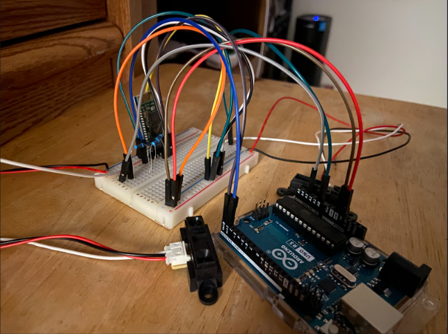
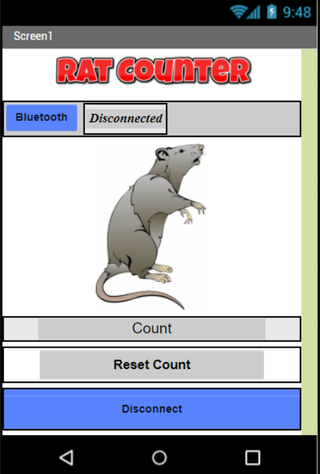

This rat counter was created for our EE 296 sophomore project. Its main purpose is to aid field researchers in detecting the number of rats that pass in either direction at a certain point. This provides a vast improvement to the current methodology, which involves manually visiting the research site and checking the amount of footprints in the enclosure. 

We used an Arduino Uno connected to an infared sensor, which can detect when an object passes in front of it, and a Bluetooth module, which we used to send the data from the sensor to the Android application we created. I was mainly in charge of writing the code for the Arduino to collect the data and also designed the circuit layout for the various elements, like the sensor and Bluetooth module.

  

Our application was made in MIT AppInventor and allows the user to select the Bluetooth device, display the current count, and reset the count. This provides researchers with a quick and convenient way to collect and view the data from our device. 

  

Click [here](https://www.youtube.com/watch?v=o3JxgTAkWKg&t=2s) to view a brief demo video.
