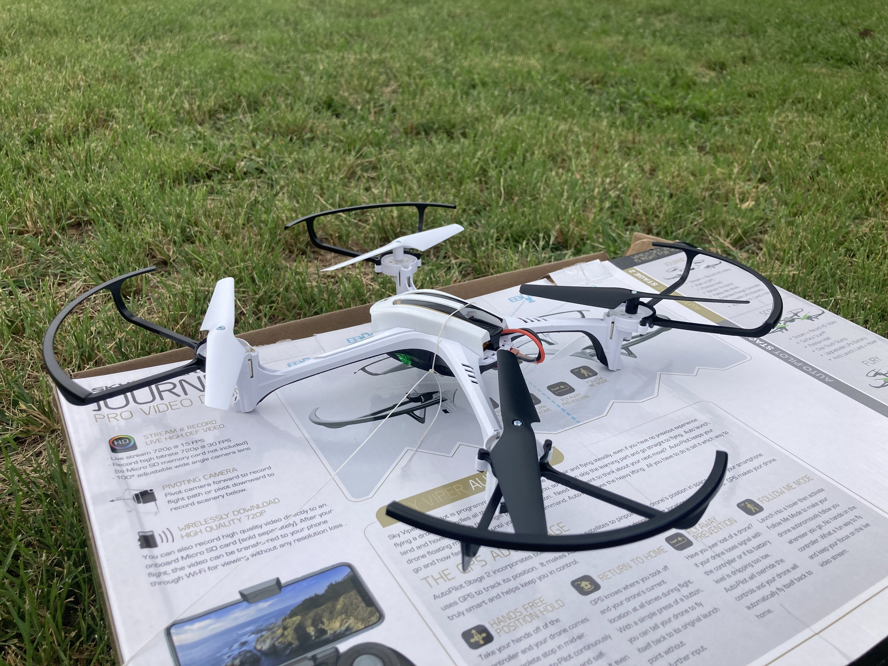
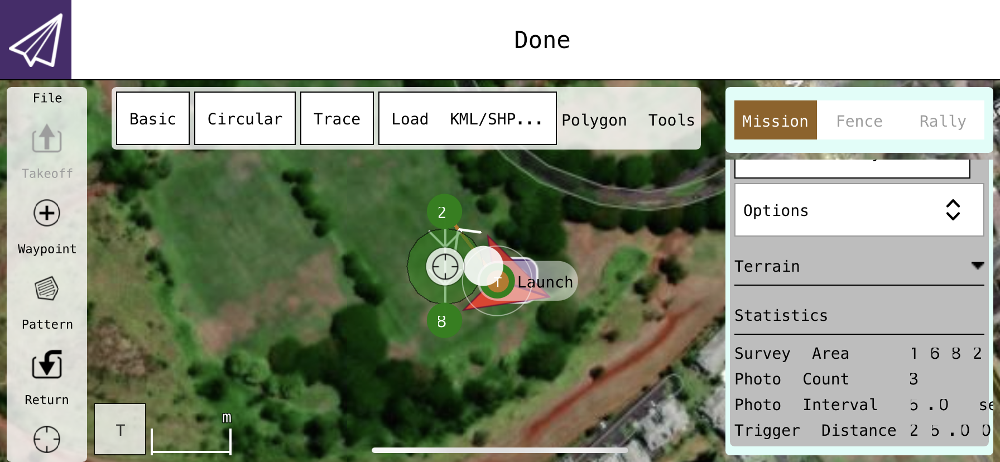

<div class="text-center p-4">
  
</div>

For my junior project, I was part of a Vertically Integrated Project (VIP) that taught us the basics of drone operation, programming, and security. We started by installing an Ubuntu virtual machine on each of our devices so we could run a series of tutorial simulations provided by ArduPilot. This software utilized a commmand line to control various aspects of the drone such as its flight mode, home location, and current missions. These simulations allowed us to familiarize ourselves with the software before we moved on to working with the actual drone.

Once we grew comfortable with that, we then moved on to learning how to operate the drone with its included joystick controller. With the practice we had through the earlier tutorials, we then began to utilize software tools such as QGroundControl to remotely control the drone's path, speed, and other flight characteristics.

<div class="text-center p-4">
  
</div>

Our next steps involved learning how to write Python scripts that automatically completed tasks similarly to what we did with QGroundControl. Below is a sample program that tells the drone to takeoff and fly to a specified altitude. 

```python
from dronekit import connect
vehicle = connect('0.0.0.0:14550', wait_ready=True)

def arm_and_takeoff(aTargetAltitude):
    print("Basic pre-arm checks")
    # Don't try to arm until autopilot is ready
    while not vehicle.is_armable:
        print(" Waiting for vehicle to initialise...")
        time.sleep(1)

    print("Arming motors")
    # Copter should arm in GUIDED mode
    vehicle.mode = VehicleMode("GUIDED")
    vehicle.armed = True

    # Confirm vehicle armed before attempting to take off
    while not vehicle.armed:
        print(" Waiting for arming...")
        time.sleep(1)

    print("Taking off!")
    vehicle.simple_takeoff(aTargetAltitude)  # Take off to target altitude

    # Wait until the vehicle reaches a safe height before processing the goto
    #  (otherwise the command after Vehicle.simple_takeoff will execute
    #   immediately).
    while True:
        print(" Altitude: ", vehicle.location.global_relative_frame.alt)
        # Break and return from function just below target altitude.
        if vehicle.location.global_relative_frame.alt >= aTargetAltitude * 0.95:
            print("Reached target altitude")
            break
        time.sleep(1)

arm_and_takeoff(3)
```
Click [here](https://docs.google.com/presentation/d/1Spg-cYv_HIr1Y0wLw7PTHKQTtB-F1mT2O4TgucA4lBY/edit?usp=sharing) to view additional information.
