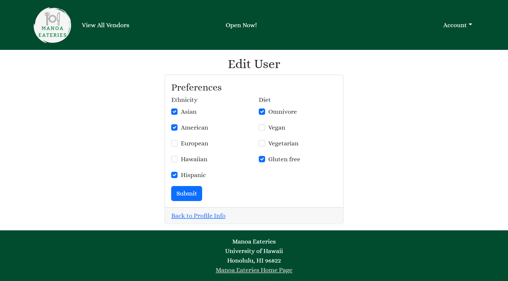

For our ICS 314 final project, we chose to create a website that allows users to see what restaurants are open on UH Manoa's campus at any given point in time. Users can also create an account to specify their dietary preferences, while vendors can create an account to specify their operating hours, location, and more. Click [here](http://143.110.235.49/) to visit our project page, which provides further details about our website and its different features. 

    

In addition to helping design the landing page, I was responsible for implementing the user profiles. I created the add and edit user pages, which allows the user to specify their favorite types of food (Asian, American, Hawaiian, etc.) and any dietary restrictions they might have (gluten free, vegan, etc.). 

  

I also wrote the website testing scripts used in TestCafe, which allowed us to verify that our website functioned the way that we intended it to. Additionally, I deployed our project to Digital Ocean, giving users an actual URL to view the website instead of having to download the source code to their machine. Click [here](http://143.110.235.49/) to visit our project deployment page.
