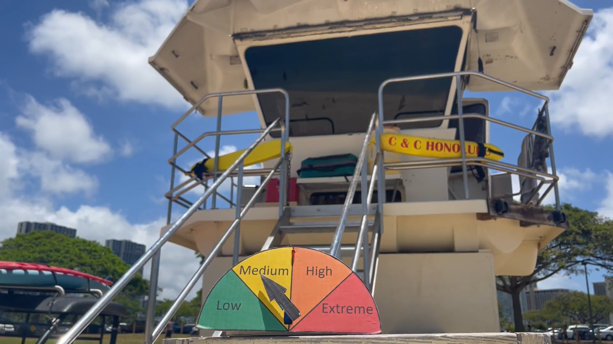
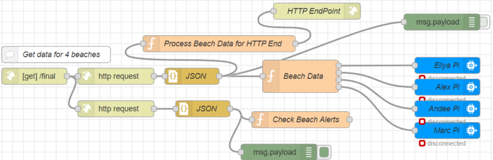

WatchTower is an IoT system that was created as a final project for EE 368: Cyber-Physical Systems. Its purpose is to give beachgoers an easy way to access current beach conditions at any Hawaii beach. Each individual Raspberry Pi device is calibrated with IBM Cloud and Node-RED to display information for a specific beach, but other devices can easily be connected and calibrated for any additional beaches. [This video](https://www.youtube.com/watch?v=a2mU8cClEGM) provides a summary and demonstration of how the system operates.

The device has a physical component, which displays the current beach condition (low, medium, high, or extreme) on a spinner display powered by a Servo. The display also has an LED light, which illuminates to notify users that there is a special alert and that they should check the Hawaii Beach Safety website for more details. There is also a software component which displays information about every device connected to the system, the beach it is currently calibrated to, and its current condition.

Below is the Node-RED flow setup that we used in order to send the beach data to each of our Raspberry Pi devices.

